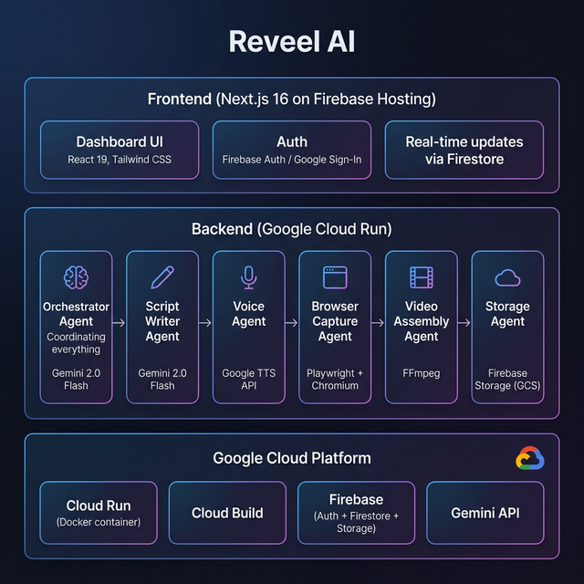

# 🎬 Reveel AI — Autonomous Product Demo Video Generator

> _Turn any website URL into a professional, narrated product demo video in under 2 minutes — powered by a multi-agent AI pipeline running entirely on Google Cloud._

[](https://studio-592211117-913e5.web.app)
[](https://console.cloud.google.com/run)
[](https://ai.google.dev)

---

## 🎯 Problem Statement

Creating product demo videos is expensive and time-consuming. Marketing teams spend **$2,000–$10,000 per video** and wait **1–3 weeks** for delivery. When products update frequently, demo videos become stale within days. Teams need a way to generate professional, narrated demo videos **instantly**.

## 💡 Solution

**Reveel AI** is a fully autonomous, multi-agent AI system that:

1. **Analyzes** any live website URL using **Gemini 2.0 Flash** to understand product features, navigation flows, and key selling points.
2. **Generates** a professional narration script tailored to the target persona (Product Manager, Sales Rep, Developer, etc.).
3. **Records** real-time browser interactions using **Playwright** — with smooth mouse movements, visual click highlights, and typing animations — paced precisely to match the voiceover duration.
4. **Synthesizes** natural-sounding voiceover audio using Google Text-to-Speech.
5. **Assembles** the final MP4 video with synchronized audio/video using **FFmpeg**.
6. **Uploads** the result to **Firebase Storage** and delivers it through a polished Next.js dashboard.

**All of this happens autonomously — no manual editing, no templates, no post-production.**

---

## 🏗️ Architecture



### Multi-Agent Pipeline

| Agent | Technology | Purpose |
|-------|-----------|---------|
| **Orchestrator** | Gemini 2.0 Flash | Coordinates the full pipeline, manages state, and updates Firestore in real-time |
| **Browser Capture Agent** | Playwright | Records live browser interactions with animated mouse, click highlights, and typing effects |
| **Script Writer Agent** | Gemini 2.0 Flash | Generates persona-targeted narration scripts with proper timing |
| **Voice Agent** | Google TTS API | Synthesizes natural voiceover audio, measures exact duration with FFprobe |
| **Video Assembly Agent** | FFmpeg | Normalizes audio, merges video + voiceover into final MP4 |
| **Storage Agent** | Firebase Storage (GCS) | Uploads final assets and generates public URLs |

### Two-Phase Generation

- **Phase 1 (Analysis)**: Gemini analyzes the URL → generates navigation plan → creates a narration script → user reviews and approves
- **Phase 2 (Synthesis)**: Voice Agent generates audio → Browser Agent records video (paced to audio duration) → Video Agent assembles MP4 → Storage Agent uploads

---

## 🛠️ Technology Stack

| Layer | Technology |
|-------|-----------|
| **Frontend** | Next.js 16, React 19, Tailwind CSS 4, Framer Motion, shadcn/ui |
| **Backend** | Next.js API Routes (server-side), Node.js |
| **AI/ML** | Gemini 2.0 Flash (`@google/genai` SDK) |
| **Browser Automation** | Playwright 1.58.2 (headless Chromium) |
| **Audio** | Google TTS API, FFprobe (duration measurement) |
| **Video Processing** | FFmpeg (MP4 encoding, audio normalization, merge) |
| **Authentication** | Firebase Auth (Google Sign-In) |
| **Database** | Firestore (real-time demo status, user management) |
| **File Storage** | Firebase Storage (Google Cloud Storage) |
| **Deployment** | Google Cloud Run (Docker), Cloud Build |
| **Container** | Docker (based on Playwright Jammy image + FFmpeg) |

---

## 🚀 Spin-Up Instructions

### Prerequisites

- **Node.js** 20+  
- **Docker** (for production builds)
- **Google Cloud CLI** (`gcloud`)
- **FFmpeg** installed locally (for dev)
- A **Firebase** project with Auth, Firestore, and Storage enabled
- A **Google AI API Key** (for Gemini)

### 1. Clone the Repository

```bash
git clone https://github.com/<your-username>/demoforge.git
cd demoforge/apps/web
```

### 2. Set Up Environment Variables

Create `.env.local`:

```env
# Firebase
NEXT_PUBLIC_FIREBASE_API_KEY=your_firebase_api_key
NEXT_PUBLIC_FIREBASE_AUTH_DOMAIN=your_project.firebaseapp.com
NEXT_PUBLIC_FIREBASE_PROJECT_ID=your_project_id
NEXT_PUBLIC_FIREBASE_STORAGE_BUCKET=your_project.firebasestorage.app
NEXT_PUBLIC_FIREBASE_MESSAGING_SENDER_ID=your_sender_id
NEXT_PUBLIC_FIREBASE_APP_ID=your_app_id
NEXT_PUBLIC_FIREBASE_MEASUREMENT_ID=your_measurement_id

# Google AI (Gemini)
GOOGLE_API_KEY=your_gemini_api_key

# App
NEXT_PUBLIC_APP_URL=http://localhost:3000
TEMP_DIR=/tmp/demoforge
```

### 3. Install Dependencies

```bash
npm install
npx playwright install chromium
```

### 4. Run in Development

```bash
npm run dev
```

Open [http://localhost:3000](http://localhost:3000) and navigate to **New Demo** to generate your first video.

### 5. Deploy to Google Cloud Run (Production)

```bash
# Build the container
gcloud builds submit --tag gcr.io/YOUR_PROJECT/reveel-backend --machine-type=e2-highcpu-8

# Deploy to Cloud Run
gcloud run deploy reveel-backend \
  --image gcr.io/YOUR_PROJECT/reveel-backend:latest \
  --region us-central1 \
  --no-cpu-throttling \
  --memory 2Gi \
  --cpu 2 \
  --set-env-vars GOOGLE_API_KEY=your_key,NEXT_PUBLIC_FIREBASE_PROJECT_ID=your_project
```

---

## 🌟 Key Features

### Multimodal AI
- **Visual Intelligence**: Gemini analyzes website structure and content to create navigation plans
- **Script Generation**: AI writes professional narration tailored to persona (Product Manager, Sales Rep, Developer)
- **Multi-language**: Supports English, Spanish, French, German

### Agentic Architecture
- **6 Autonomous Agents**: Each agent focuses on a specific task, communicating through a shared pipeline state
- **Graceful Fallbacks**: Every agent has robust error handling and fallback strategies
- **Real-time Progress**: Firestore streams live status updates to the dashboard

### Production-Ready
- **Admin Dashboard**: User management, demo approval system, analytics
- **Rate Limiting**: Built-in demo creation limits
- **Dockerized**: Single container runs Chromium, FFmpeg, and Node.js
- **Cloud Native**: Deployed on Google Cloud Run with CPU always-on

---

## 📂 Project Structure

```
apps/web/
├── src/
│   ├── app/                    # Next.js pages & API routes
│   │   ├── api/demos/          # REST API for demo CRUD + generation
│   │   ├── dashboard/          # User dashboard (generate, library, settings)
│   │   └── admin/              # Admin panel (users, demos, support)
│   ├── lib/
│   │   ├── agents/             # Multi-agent pipeline
│   │   │   ├── orchestrator.ts # Master coordinator
│   │   │   ├── browser-agent.ts# Playwright recorder with visual effects
│   │   │   ├── script-agent.ts # Gemini script writer
│   │   │   ├── voice-agent.ts  # Google TTS synthesizer
│   │   │   ├── video-agent.ts  # FFmpeg assembler
│   │   │   ├── storage-agent.ts# Firebase Storage uploader
│   │   │   └── types.ts        # Shared interfaces
│   │   └── firebase/           # Firebase client config
│   └── components/             # React UI components
├── Dockerfile                  # Playwright + FFmpeg container
└── hack_fest/                  # Hackathon submission materials
```

---

## 🔍 Findings & Learnings

1. **Audio/Video Synchronization is Hard**: The biggest challenge was ensuring the voiceover and browser recording are perfectly aligned. We solved this by generating audio first, measuring its exact duration with FFprobe, then pacing Playwright actions to evenly fill that duration.

2. **Concatenated MP3 Buffers Need Normalization**: Google TTS returns multiple base64-encoded MP3 chunks. Simply concatenating them creates files with inconsistent headers that FFmpeg's `filter_complex` silently drops. The fix was adding a normalization pass to a clean AAC file first.

3. **AI-Generated CSS Selectors Are Unreliable**: When Gemini generates navigation plans, it often produces text descriptions like "Homes" instead of valid CSS selectors. We built a multi-strategy locator system that tries `getByRole`, `getByText`, `getByPlaceholder`, and CSS fallbacks.

4. **Cloud Run Needs CPU Always-On**: Playwright and FFmpeg are long-running processes. By default, Cloud Run throttles CPU between requests, which kills the browser mid-recording. The `--no-cpu-throttling` flag was essential.

5. **State Serialization Across Phases**: The two-phase pipeline (analyze → approve → generate) requires serializing and deserializing the pipeline state to disk. This required careful attention to file path management across phases.

---

## 📄 License

MIT License — Built for Google AI Hackathon 2025
